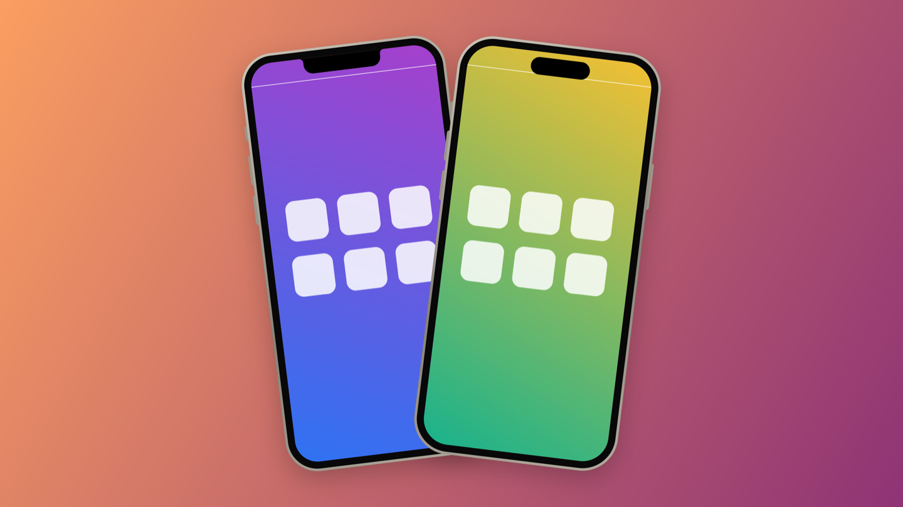

<p align="center"></p>

# MirrorAct

iPhone oder iPad auf dem Mac spiegeln, rahmen und aufnehmen – per Kabel oder kabellos.
Open Source, alles bleibt auf deinem Mac.

*English: [README.md](README.md)*

<p align="center"></p>

## Warum

Apples *iPhone Mirroring* gibt es in der EU nicht; Apple begründet das mit dem Digital Markets
Act. Daher der Name. MirrorAct zeigt den Bildschirm von iPhone oder iPad im Gerätrahmen auf dem
Mac – für Demos, Präsentationen, Screenshots und Bildschirmaufnahmen. Bedienen lässt sich das
Gerät damit nicht.

## Funktionen

- **Kabel (USB):** Bildabgriff wie bei QuickTime (CoreMediaIO, AVFoundation). Geringste Verzögerung, mit Ton.
- **Kabellos:** eigener AirPlay-Empfänger für die Bildschirmsynchronisierung. VideoToolbox dekodiert ohne Puffer, Ton inklusive. Neben dem WLAN bietet er sich auch über AWDL an (Apples Direktfunk), damit es auch klappt, wenn der Router Bonjour nicht weiterleitet.
- **Gerätrahmen** pro Modell gezeichnet: Notch, Dynamic Island, Home-Button, iPad, hoch und quer. Sieben Rahmenfarben.
- **Fenster ohne Leiste:** nur das Gerät auf dem Schreibtisch. Fährt die Maus darüber, erscheint daneben eine Werkzeugleiste: Aufnahme, Foto, Ton, Oben, Vollbild, Stil. Ein Rechtsklick zeigt alle Funktionen.
- **Stil-Panel:** Grösse (lebensgross, pixelgenau, punktgenau, Bildschirm füllen), Rahmen an/aus, Rahmenfarbe, Hintergrund (transparent, Verläufe, Farbe, Bild), Abstand, Schatten, Format (1:1, 16:9, 9:16, 4:3).
- **Screenshots und Aufnahmen** mit oder ohne Rahmen und Hintergrund. Mit transparentem Hintergrund entstehen PNG bzw. HEVC mit Alpha für Keynote und Schnittprogramme, sonst H.264. Screenshots lassen sich direkt aus dem Fenster ziehen.
- **Präsentieren:** Gerät mittig auf dem Hintergrund, im Vollbild ohne Menüleiste und Dock.
- **Editor:** vorhandene Screenshots und Bildschirmaufnahmen nachträglich rahmen, Videos kürzen, zwei Screenshots als **Duo** (nebeneinander, versetzt, gekippt, perspektivisch).
- **Kurzbefehle:** «Screenshot einrahmen» (auch als Finder-Schnellaktion), «Screenshot vom iPhone», «Aufnahme starten oder beenden».

Die Oberfläche ist derzeit deutsch; eine englische Fassung ist geplant.

## Voraussetzungen

- macOS 15 oder neuer (getestet auf Apple Silicon)
- Xcode 16 oder neuer
- [Homebrew](https://brew.sh)-Pakete:

```bash
brew install xcodegen cmake pkgconf libplist openssl@3 gstreamer
```

GStreamer braucht nur UxPlays CMake beim Konfigurieren, MirrorAct selbst nutzt es nicht. OpenSSL
und libplist werden statisch gelinkt, die fertige App braucht kein Homebrew.

## Bauen

```bash
scripts/build.sh
```

Das Skript holt UxPlay mit festem Commit nach `Vendor/`, baut nur dessen AirPlay-Bibliothek,
erzeugt das Xcode-Projekt mit XcodeGen, baut die App und installiert sie nach
`~/Applications/MirrorAct.app`. `--debug` baut die Debug-Konfiguration, `--no-install` lässt die
Installation weg.

Standardmässig wird ad-hoc signiert. macOS fragt dann nach jedem Build erneut nach dem
Kamerazugriff. Damit die Freigabe bleibt, mit eigenem Zertifikat signieren:
`Config/Local.xcconfig.example` nach `Config/Local.xcconfig` kopieren und Signatur und Team
eintragen.

## Benutzung

- **Kabel:** Gerät anschliessen und entsperren, «Diesem Computer vertrauen» bestätigen, dann im Startfenster anklicken. Beim ersten Mal fragt macOS nach dem Kamerazugriff – so stellt macOS den Gerätebildschirm bereit.
- **Kabellos:** Auf dem Gerät Kontrollzentrum → Bildschirmsynchronisierung → «MirrorAct». Beim ersten Mal den Code aus dem Startfenster eingeben. Erscheint «MirrorAct» nicht, in macOS den AirPlay-Empfänger einschalten (Allgemein → AirDrop & Handoff).
- **Tastatur:** ⌘R Aufnahme, ⌘S Screenshot, ⇧⌘C Screenshot kopieren, ⌘K Stil-Panel, ⌃⌘F Präsentieren, ⌘T immer im Vordergrund, ⌘1 lebensgross, ⌘2 pixelgenau, ⌘0 punktgenau, ⌘E Editor.

Einstellungen unter MirrorAct → Einstellungen, das Log in `~/Library/Logs/MirrorAct.log`.

## Aufbau

Siehe Tabelle im [englischen README](README.md#how-it-works). Ohne Gerät lässt sich die Darstellung
prüfen:

```bash
~/Applications/MirrorAct.app/Contents/MacOS/MirrorAct --render-test /tmp/mirroract-render
```

## Datenschutz

MirrorAct arbeitet lokal, sendet keine Daten und hat keine Telemetrie. Netzwerkzugriff gibt es nur
für den AirPlay-Empfänger im lokalen Netz und über AWDL.

## Rechtliches

MirrorAct steht in keiner Verbindung zu Apple Inc. iPhone, iPad, AirPlay und macOS sind Marken
von Apple Inc. Der kabellose Empfang nutzt die unabhängige AirPlay-Umsetzung des Projekts
[UxPlay](https://github.com/FDH2/UxPlay). Geschützte Inhalte (z. B. aus Streaming-Apps) sperrt
iOS; sie lassen sich nicht spiegeln.

## Lizenz

GPL-3.0-or-later, siehe [LICENSE](LICENSE). Fremdkomponenten: [THIRD_PARTY_NOTICES.md](THIRD_PARTY_NOTICES.md).
