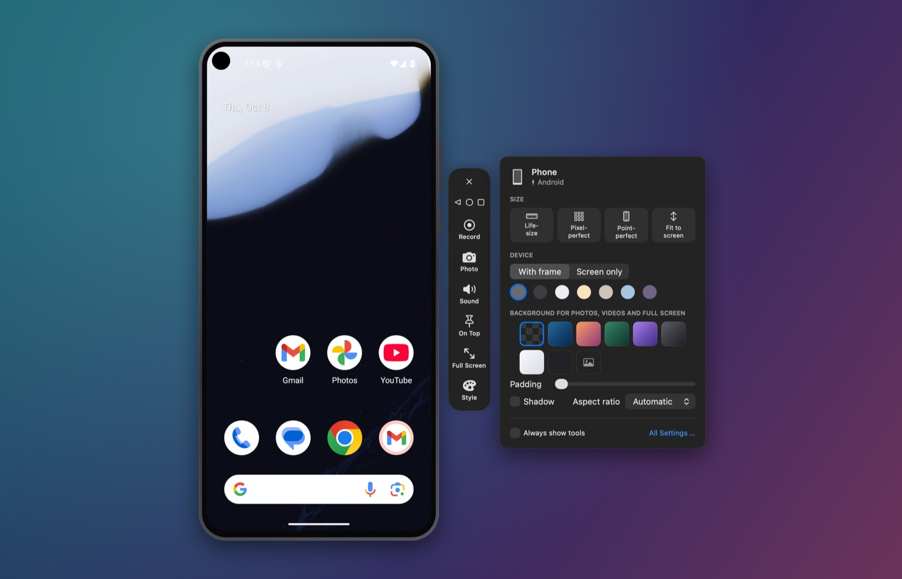

<p align="center"></p>

# MirrorAct

Mirror, frame and record your iPhone, iPad or Android phone on your Mac – over a cable or wirelessly.
Open source, everything stays on your Mac.

*Deutsch: [README.de.md](README.de.md)*

<p align="center"></p>

## Why

Apple's *iPhone Mirroring* is not available in the EU; Apple cites the Digital Markets Act.
MirrorAct is named after that gap. It shows the screen of your iPhone, iPad or Android phone on
your Mac in a device frame – for demos, presentations, screenshots and screen recordings. Android
phones and, with a small test agent, iPhones and iPads can also be controlled with mouse and
keyboard.

## Get started

### 1. Install

With [Homebrew](https://brew.sh):

```bash
brew install --cask sopitz/tap/mirroract
```

Or download `MirrorAct-<version>.zip` from [Releases](https://github.com/sopitz/MirrorAct/releases),
unzip it and move MirrorAct to Applications. MirrorAct needs macOS 15 or later on a Mac with Apple
silicon. It is signed with a Developer ID and notarized by Apple. Update with
`brew upgrade --cask mirroract`.

### 2. Connect a device

Open MirrorAct. The start window shows your devices, the code for wireless mirroring and a guide
for connecting a device.

- **iPhone or iPad by cable:** connect and unlock the device, confirm "Trust This Computer", then click it in the start window. On first use, macOS asks for camera access – that is how macOS provides the device screen.
- **iPhone or iPad wirelessly:** on the device, open Control Center → Screen Mirroring → "MirrorAct". The first time, enter the code shown in the start window. If "MirrorAct" does not appear, turn on AirPlay Receiver in macOS (General → AirDrop & Handoff).
- **Android phone:** MirrorAct needs adb, from Homebrew (`brew install android-platform-tools`) or from the Android SDK (`~/Library/Android/sdk`). Turn on USB debugging once (Settings → About phone → tap "Build number" seven times, then Settings → Developer options → USB debugging), connect the phone, tap "Allow" on the phone and click it in the start window. For Wi-Fi, right-click the phone in the start window → "Use Wi-Fi Instead of Cable" and then unplug the cable – an open window continues over Wi-Fi – or pair it without a cable under Connect a Device → Android (Android 11 or later).

### 3. Frame, capture, present

The mirror window shows only the device in its frame. Move the mouse over it and a tool rail
appears next to it; right-click shows every function.

- ⌘S takes a screenshot, ⌘R starts and stops a recording. Drag screenshots straight out of the window.
- ⌘K opens the style panel: size, frame color, background, padding, shadow, aspect ratio.
- ⌃⌘F presents the device full screen on your background.
- ⌘E opens the editor, for screenshots and recordings you already have.

## Screenshots

| Start window | Editor |
|---|---|
|  |  |

**Result:** a framed screenshot on a gradient, exported from the mirror window


## Features

- **Cable (USB):** captures the screen the way QuickTime does (CoreMediaIO, AVFoundation). Lowest latency, with audio.
- **Wireless:** built-in AirPlay screen mirroring receiver. Decoding with VideoToolbox without buffering, audio included. Besides the local network it also advertises itself over AWDL (Apple's peer-to-peer Wi-Fi), so it works when the router does not forward Bonjour.
- **Android:** over USB debugging, by cable or Wi-Fi, with the [scrcpy](https://github.com/Genymobile/scrcpy) server on the phone: video decoded without buffering, sound from Android 11, control with mouse, trackpad and keyboard, clipboard in both directions; see [Controlling an Android phone](#controlling-an-android-phone).
- **iPhone and iPad control** (optional, for developers): mouse, trackpad and keyboard through a test agent on the device (WebDriverAgent), by cable or wirelessly; see [Controlling an iPhone or iPad](#controlling-an-iphone-or-ipad).
- **Device frames** drawn for each model: notch, Dynamic Island, home button, iPad, Android with punch-hole camera (position and corner radius read from the phone), portrait and landscape. Seven frame colors.
- **Window without chrome:** only the device on your desktop. A tool rail appears next to it on hover: record, screenshot, sound, keep on top, full screen, style. Right-click shows every function.
- **Style panel:** size (life-size, pixel-perfect, point-perfect, fit), frame on/off, frame color, background (transparent, gradients, color, image), padding, shadow, aspect ratio (1:1, 16:9, 9:16, 4:3).
- **Screenshots and recordings** with or without frame and background. Transparent backgrounds produce PNG or HEVC with alpha for Keynote and video editors, otherwise H.264. Drag screenshots straight out of the window.
- **Presentation mode:** device centered on your background, full screen, without menu bar and Dock.
- **Editor:** frame existing screenshots and screen recordings afterwards, trim videos, two screenshots as a **duo** (side by side, staggered, tilted, perspective).
- **Shortcuts:** "Frame screenshot" (usable as a Finder Quick Action), "Screenshot from iPhone", "Start or stop recording".

The user interface is available in English and German; choose the language under Settings → General (System language, Deutsch, English).

## Keyboard and settings

⌘R record, ⌘S screenshot, ⇧⌘C copy screenshot, ⌘K style panel, ⌃⌘F present, ⌘T keep on top,
⌘1 life-size, ⌘2 pixel-perfect, ⌘0 point-perfect, ⌘E editor.

Settings live under MirrorAct → Settings, the log in `~/Library/Logs/MirrorAct.log`.

## Controlling an Android phone

As soon as an Android phone is mirrored, the mirror window controls it:

<p align="center"></p>

- click: tap, drag: swipe (the finger follows the mouse live), ⌘-drag moves the window
- trackpad or mouse wheel: scroll, middle click: Home
- typing goes to the phone, including umlauts and other characters; Esc is Back, ⌘V pastes the Mac clipboard, text copied on the phone lands in the Mac clipboard
- Back, Home and Recent Apps are in the tool rail, in the order and look of the phone's navigation bar (Samsung: Recent Apps, Home, Back); notifications, volume, screen on/off and rotation in the context menu

Nothing is installed permanently: while mirroring, the scrcpy server runs from a temporary file on
the phone and ends when the window is closed. Sound needs Android 11 or later and plays on the Mac
instead of the phone. Apps that protect their content (banking, streaming) stay black.

## Controlling an iPhone or iPad

Optional, for developers: with a small test agent on the device, MirrorAct passes clicks, drags,
scrolling and typing on to the iPhone or iPad. iOS allows this only for UI tests, so MirrorAct
does it the way Xcode automates apps: [WebDriverAgent](https://github.com/appium/WebDriverAgent)
(from the Appium project) runs as a UI test on the device, started with `xcodebuild`.

You need:

- Xcode in a version that supports the iOS version of the device
- an Apple developer team (a free Apple ID works too, but its signature expires after 7 days)
- on the device: **Developer Mode** (Settings → Privacy & Security → Developer Mode; the device restarts) and, afterwards, **Enable UI Automation** under Settings → Developer

Clone this repository, copy `Config/Local.xcconfig.example` to `Config/Local.xcconfig` and enter
your team ID as `DEVELOPMENT_TEAM`. Then build the agent once (again after a change of team or
Xcode version). This works with MirrorAct from Homebrew too; it needs only Xcode, not the packages
for building MirrorAct itself:

```bash
scripts/build-agent.sh
```

It is signed with your team and placed in `~/Library/Application Support/MirrorAct/Agent`. If the
device is not yet registered with your team, connect it and pass its identifier from Xcode →
Devices and Simulators: `scripts/build-agent.sh --device <UDID>`.

Control starts by itself as soon as the device connects; starting the agent on the device takes a
few seconds. If it cannot start, for example because the device is locked, the **Control** button
stays in the tool rail; clicking it (or Device → Control Device, ⌥⌘C) checks again and says what is
missing. To start control only when you want, turn off "Start control when a device connects" under
MirrorAct → Settings → General. After you turn control off or close the window, the agent keeps
running on the device for five minutes, so control is back at once; quitting MirrorAct stops it.
Then:

- click: tap, hold: long press, drag: swipe
- trackpad or mouse wheel: scroll (iOS adds the momentum itself)
- typing goes to the active text field, ⌘V types the text from the Mac clipboard
- Home, App Switcher, Notification Center, volume and lock are in the tool rail and the context menu

This works over the cable and wirelessly; MirrorAct reaches the agent through usbmuxd (like Xcode)
or over the local network. Gestures are sent when you release the mouse button, so the finger does
not follow the mouse live. A device with a passcode cannot be unlocked this way. The output of
`xcodebuild` is in `~/Library/Logs/MirrorAct-Agent.log`.

## Privacy

MirrorAct works locally. It does not send any data anywhere and has no telemetry. Network access
is limited to the AirPlay receiver on your local network and over AWDL, to adb for Android phones
(by cable, or on your local network when you use Wi-Fi), and, while you control an iPhone or iPad,
to the agent on that device.

## Legal

MirrorAct is not affiliated with, endorsed or sponsored by Apple Inc. iPhone, iPad, AirPlay and
macOS are trademarks of Apple Inc. The wireless receiver uses the independent AirPlay
implementation of the [UxPlay](https://github.com/FDH2/UxPlay) project. Protected content (for
example from streaming apps) is blocked by iOS and cannot be mirrored.

Android is a trademark of Google LLC; MirrorAct is not affiliated with Google. Android mirroring
uses the server of the [scrcpy](https://github.com/Genymobile/scrcpy) project by Genymobile.

## Feedback and contributing

Found a bug or missing something? Open an [issue](https://github.com/sopitz/MirrorAct/issues).
To build MirrorAct yourself or work on it – build from source, code structure, branches and
releases – see [CONTRIBUTING.md](CONTRIBUTING.md).

## Support

MirrorAct is free. If it saves you time, you can [buy me a coffee](https://buymeacoffee.com/sopitz).

[](https://buymeacoffee.com/sopitz)

## License

GPL-3.0-or-later, see [LICENSE](LICENSE). Third-party components: [THIRD_PARTY_NOTICES.md](THIRD_PARTY_NOTICES.md).
