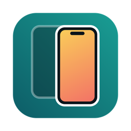
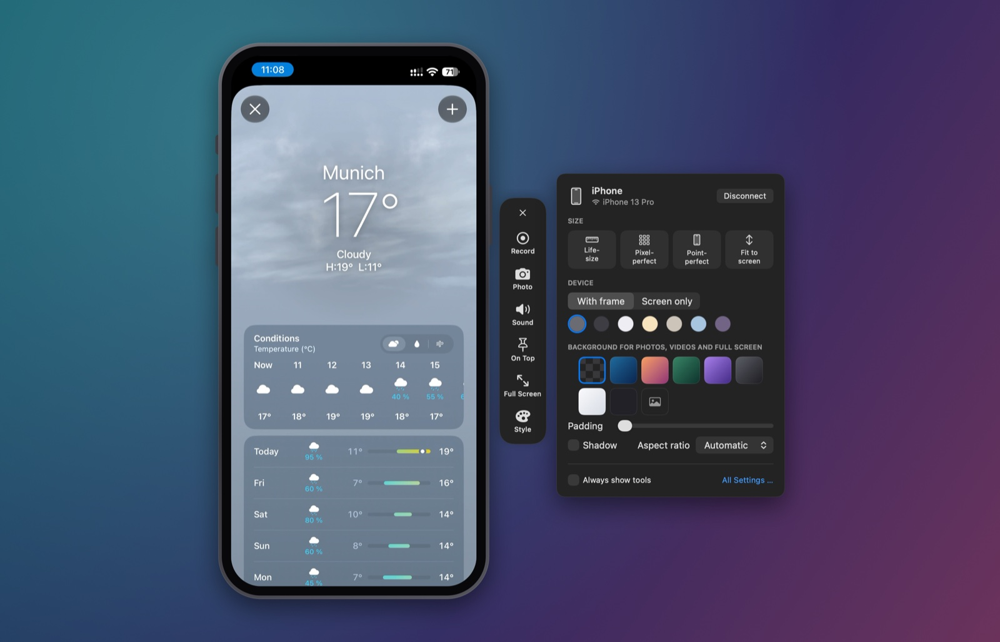
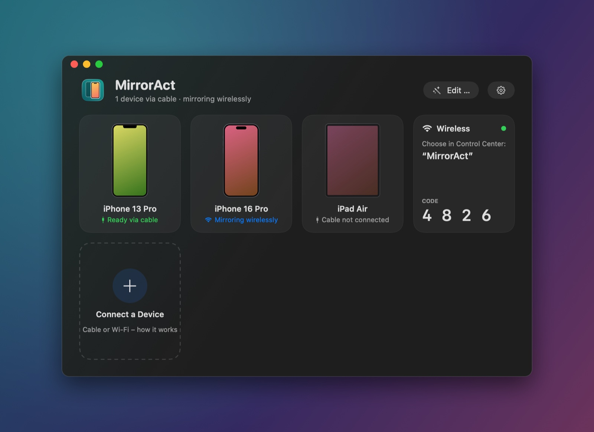
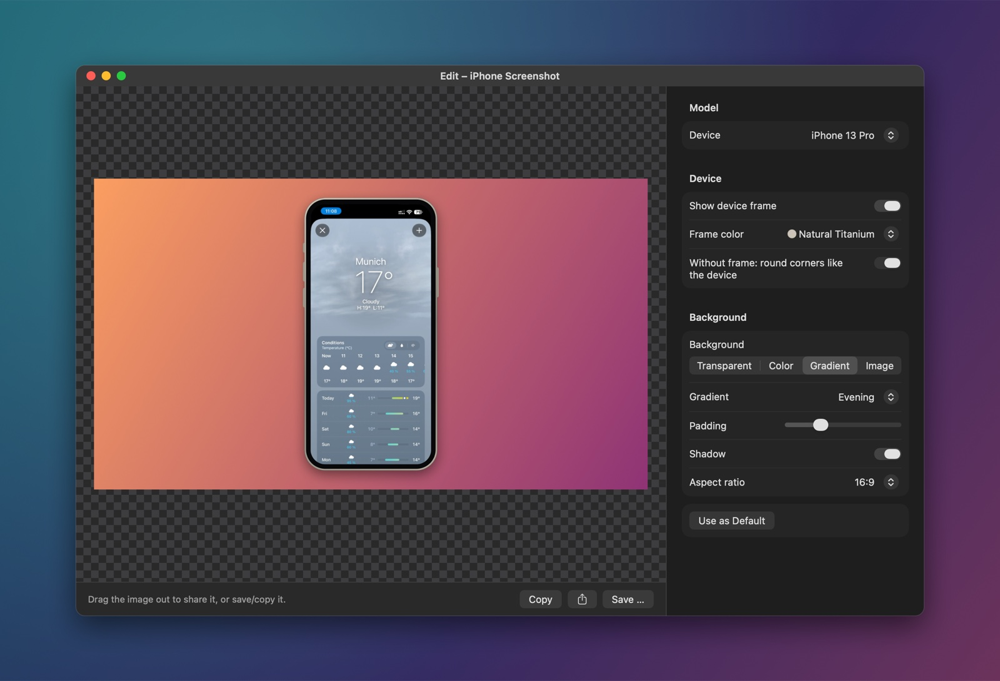
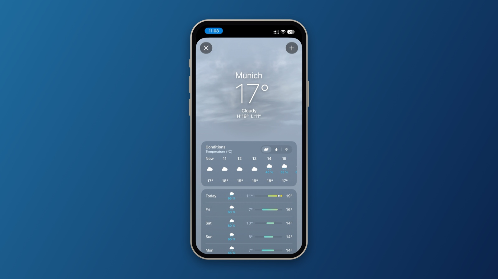

<p align="center"></p>

# MirrorAct

Mirror, frame and record your iPhone or iPad on your Mac – over a cable or wirelessly.
Open source, everything stays on your Mac.

*Deutsch: [README.de.md](README.de.md)*

<p align="center"></p>

## Why

Apple's *iPhone Mirroring* is not available in the EU; Apple cites the Digital Markets Act.
MirrorAct is named after that gap. It shows the screen of your iPhone or iPad on your Mac in a
device frame – for demos, presentations, screenshots and screen recordings. It does not control
the device.

## Screenshots

| Start window | Editor |
|---|---|
|  |  |

**Result:** a framed screenshot on a gradient, exported from the mirror window



## Features

- **Cable (USB):** captures the screen the way QuickTime does (CoreMediaIO, AVFoundation). Lowest latency, with audio.
- **Wireless:** built-in AirPlay screen mirroring receiver. Decoding with VideoToolbox without buffering, audio included. Besides the local network it also advertises itself over AWDL (Apple's peer-to-peer Wi-Fi), so it works when the router does not forward Bonjour.
- **Device frames** drawn for each model: notch, Dynamic Island, home button, iPad, portrait and landscape. Seven frame colors.
- **Window without chrome:** only the device on your desktop. A tool rail appears next to it on hover: record, screenshot, sound, keep on top, full screen, style. Right-click shows every function.
- **Style panel:** size (life-size, pixel-perfect, point-perfect, fit), frame on/off, frame color, background (transparent, gradients, color, image), padding, shadow, aspect ratio (1:1, 16:9, 9:16, 4:3).
- **Screenshots and recordings** with or without frame and background. Transparent backgrounds produce PNG or HEVC with alpha for Keynote and video editors, otherwise H.264. Drag screenshots straight out of the window.
- **Presentation mode:** device centered on your background, full screen, without menu bar and Dock.
- **Editor:** frame existing screenshots and screen recordings afterwards, trim videos, two screenshots as a **duo** (side by side, staggered, tilted, perspective).
- **Shortcuts:** "Frame screenshot" (usable as a Finder Quick Action), "Screenshot from iPhone", "Start or stop recording".

The user interface is available in English and German; choose the language under Settings → General (System language, Deutsch, English).

## Requirements

- macOS 15 or later (tested on Apple silicon)
- Xcode 16 or later
- [Homebrew](https://brew.sh) packages:

```bash
brew install xcodegen cmake pkgconf libplist openssl@3 gstreamer
```

GStreamer is only needed because UxPlay's CMake looks for it while configuring; MirrorAct does not
use it. OpenSSL and libplist are linked statically, so the finished app does not depend on Homebrew.

## Build

```bash
scripts/build.sh
```

The script fetches UxPlay at a pinned commit into `Vendor/`, builds only its AirPlay library,
generates the Xcode project with XcodeGen, builds the app and installs it to
`~/Applications/MirrorAct.app`. `--debug` builds the debug configuration, `--no-install` skips the
installation.

By default the app is signed ad hoc. macOS then asks for camera access again after every build.
To keep the permission, sign with your own certificate: copy `Config/Local.xcconfig.example` to
`Config/Local.xcconfig` and enter your signing identity and team.

## Usage

- **Cable:** connect and unlock the device, confirm "Trust This Computer", then click it in the start window. On first use, macOS asks for camera access – that is how macOS provides the device screen.
- **Wireless:** on the device, open Control Center → Screen Mirroring → "MirrorAct". The first time, enter the code shown in the start window. If "MirrorAct" does not appear, turn on AirPlay Receiver in macOS (General → AirDrop & Handoff).
- **Keyboard:** ⌘R record, ⌘S screenshot, ⇧⌘C copy screenshot, ⌘K style panel, ⌃⌘F present, ⌘T keep on top, ⌘1 life-size, ⌘2 pixel-perfect, ⌘0 point-perfect, ⌘E editor.

Settings live under MirrorAct → Settings, the log in `~/Library/Logs/MirrorAct.log`.

## Controlling an iPhone or iPad

Optional, for developers: with a small test agent on the device, MirrorAct passes clicks, drags,
scrolling and typing on to the iPhone or iPad. iOS allows this only for UI tests, so MirrorAct
does it the way Xcode automates apps: [WebDriverAgent](https://github.com/appium/WebDriverAgent)
(from the Appium project) runs as a UI test on the device, started with `xcodebuild`.

You need:

- Xcode in a version that supports the iOS version of the device
- an Apple developer team in `Config/Local.xcconfig` (a free Apple ID works too, but its signature expires after 7 days)
- on the device: **Developer Mode** (Settings → Privacy & Security → Developer Mode; the device restarts) and, afterwards, **Enable UI Automation** under Settings → Developer

Build the agent once (again after a change of team or Xcode version):

```bash
scripts/build-agent.sh
```

It is signed with your team and placed in `~/Library/Application Support/MirrorAct/Agent`. If the
device is not yet registered with your team, connect it and pass its identifier from Xcode →
Devices and Simulators: `scripts/build-agent.sh --device <UDID>`.

In the mirror window, click **Control** in the tool rail (or Device → Control Device, ⌥⌘C).
Starting the agent on the device takes a few seconds. Then:

- click: tap, hold: long press, drag: swipe
- trackpad or mouse wheel: scroll (iOS adds the momentum itself)
- typing goes to the active text field, ⌘V types the text from the Mac clipboard
- Home, App Switcher, Notification Center, volume and lock are in the tool rail and the context menu

This works over the cable and wirelessly; MirrorAct reaches the agent through usbmuxd (like Xcode)
or over the local network. Gestures are sent when you release the mouse button, so the finger does
not follow the mouse live. A device with a passcode cannot be unlocked this way. The output of
`xcodebuild` is in `~/Library/Logs/MirrorAct-Agent.log`.

## How it works

| Folder | Content |
|---|---|
| `MirrorAct/AirPlay` | `airplay_bridge.c` – thin C layer over UxPlay's AirPlay library (Bonjour, heartbeat, restart), `AirPlayReceiver`, `AirPlayAudioPlayer` (AAC-ELD) |
| `MirrorAct/Video` | `AnnexBDecoder` (H.264/HEVC → VideoToolbox), `FrameSink` / `VideoDisplayView` (AVSampleBufferDisplayLayer) |
| `MirrorAct/USB` | device discovery and capture (`AVCaptureDevice`, `.muxed`) |
| `MirrorAct/Frame` | device profiles, frame geometry, `FrameStyle`, `SceneRenderer` (Core Image; shared by screenshots, recordings and the editor) |
| `MirrorAct/Mirror` | mirror window, tool rail, style panel, presentation, `DeviceControl` (interface for controlling a device) |
| `MirrorAct/Control` | iPhone/iPad control: `IOSControl` (gestures, keyboard, start of the agent via `xcodebuild`), `AgentConnection` (HTTP to WebDriverAgent), `USBMux` (usbmuxd) |
| `MirrorAct/Recording` | `MirrorRecorder` (AVAssetWriter, host time, variable frame rate) |
| `MirrorAct/Editor` | editor, `DuoRenderer`, `VideoFramer` (AVVideoComposition + export) |
| `MirrorAct/Intents` | App Intents for Shortcuts |
| `MirrorAct/Launcher` | start window, settings |
| `MirrorAct/Localization` | String Catalogs (English source, German translation), Info.plist and Siri phrases |

Without a device you can check the rendering:

```bash
~/Applications/MirrorAct.app/Contents/MacOS/MirrorAct --render-test /tmp/mirroract-render
```

This writes frames, styles, duo poses and UI parts as PNG files, records two short test videos
(with rotation and with AAC-ELD audio as sent over AirPlay) and frames one of them like the editor.

The screenshots above are drawn by the app itself from its real views (debug builds,
`MirrorAct --showcase <folder>`, or while mirroring via the distributed notification
`io.github.sopitz.MirrorAct.showcase`); the device screen is the live mirrored frame.

## Privacy

MirrorAct works locally. It does not send any data anywhere and has no telemetry. Network access
is limited to the AirPlay receiver on your local network and over AWDL, and, while you control a
device, to the agent on that device.

## Legal

MirrorAct is not affiliated with, endorsed or sponsored by Apple Inc. iPhone, iPad, AirPlay and
macOS are trademarks of Apple Inc. The wireless receiver uses the independent AirPlay
implementation of the [UxPlay](https://github.com/FDH2/UxPlay) project. Protected content (for
example from streaming apps) is blocked by iOS and cannot be mirrored.

## License

GPL-3.0-or-later, see [LICENSE](LICENSE). Third-party components: [THIRD_PARTY_NOTICES.md](THIRD_PARTY_NOTICES.md).
